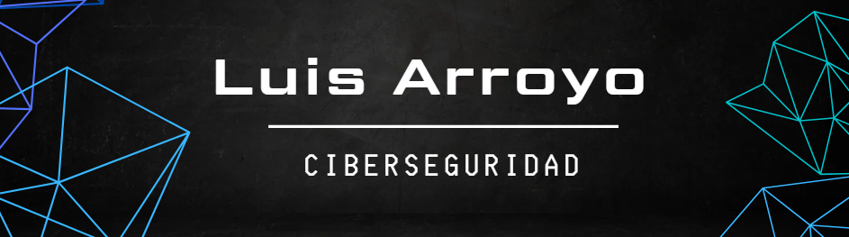

<h1 align=center> ¿Te sientes a salvo en internet? </h1>
<h3>Si tu respuesta es no, ¡prepárate para sumergirte en el emocionante y misterioso mundo de la ciberseguridad! Solo los curiosos de verdad, esos que no pueden resistirse a descubrir cómo funcionan las cosas, somos los valientes exploradores de este fascinante universo lleno de retos y sorpresas 🚀🔐.  </h3>

## ¿Quién soy?

- 📡 Entusiasta de Ciberseguridad.
- 🎮 Actualmente cursando la carrera de Ingeniería en Ciberseguridad.
- 🥼 Especialmente interesado en la Forensia Digital.
- 🥇 Mi meta es generar un impacto positivo y contribuir al crecimiento de esta comunidad.

